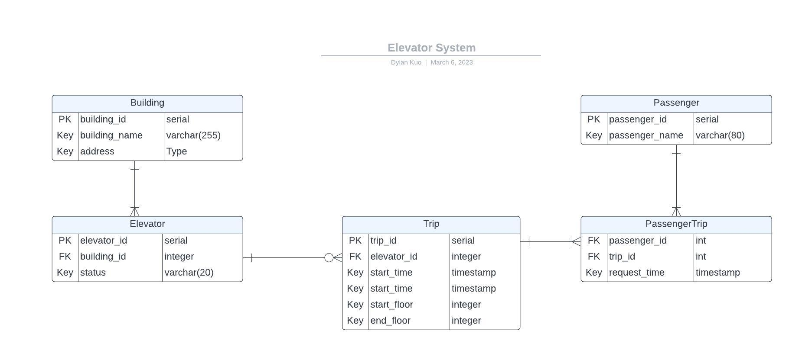
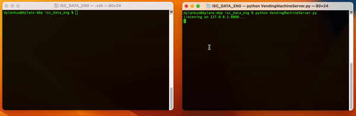

# ISC Data Engineering Assessment

## Exercise 1: Data Modeling/SQL
&nbsp;



### a. Design Considerations
- Building: The building where the elevators belong to. It consists of building_id (primary key), building_name, and the address. 

- Elevator: Each elevator installed in the building. It constits of elevator_id (primary key), building_id (foreign key referencing Building), status that signifies out of service or in srevice.

- Trip: Each trip made by the elevator and the passenger. It consists trip_id (primary key), elevator_id (foreign key referencing Elevator), start_time, end_time, start_floor, end_floor.

- Passenger: Each Passenger who requested a trip. It consists of passenger_id (primary key), passenger_name.

- PassengerTrip: The bridging table between Passenger and Trip for the many-to-many relationship implementation (ie, one passenger can have multiple trips. one trip can involve multiple passenger). It consists of passenger_id (foreign key referencing Passenger), trip_id (foreign key referencing Trip), request_time. The combincation of passenger_id and trip_id acts as a composite key.


### b. Assumptions 

- The elevator system only records the start and end floors when a passenger requests a trip. Information about intermediate floors is not captured to simplify the logic.

- The direction of the elevator (i.e., up or down) is not recorded. It can be inferred from the start and end floors.

- The elevator is assumed to have no capacity limitation, and the number of passengers on the same elevator is not recorded.
  

### Sql Queries for Metrics

1.  Total number of passengers per day
  
    ```
    SELECT date(start_time) AS date, COUNT(distinct passenger_id) AS total_passengers
    FROM trip
    JOIN PassengerTrip ON trip.trip_id = PassengerTrip.trip_id
    GROUP by date(start_time)
    ```

2.  Total number of trips per day
  
    ```
    SELECT count(*) AS total_trips
    FROM Trip
    ```

3.  Average number of passengers per trip
  
     ```
     SELECT COUNT(distinct passenger_id)/COUNT(distinct trip_id) AS avg_passengers_per_trip
     FROM Trip
     JOIN PassengerTrip ON Trip.trip_id = PassengerTrip.trip_id
     ```

4.  Average wait time for passengers
  
    ```
    SELECT AVG(start_time - request_time) AS avg_wait_time
    FROM Trip t
    JOIN PassengerTrip ON Trip.trip_id = PassengerTrip.trip_id
    ```

5.  Average travel time per trip
  
    ```
    SELECT AVG(end_time - start_time) AS avg_travel_time
    FROM Trip
    ```

6.  Busiest times of the day/week for the elevator system
  
    ```
    SELECT DATE_PART('hour', start_time) AS hour_of_day, DATE_PART('dow', start_time) AS day_of_week, COUNT(trip_id) AS total_trips
    FROM Trip
    GROUP BY HOUR(start_time), DAYOFWEEK(start_time)
    ORDER BY COUNT(trip_id) DESC;
    ```

&nbsp;

## Exercise 2: Software Design/Coding
&nbsp;

### How to Run?
1. Clone this project from the repository
2. Navigate to the root directory of the project 
    ```
    cd <path_to_your_directory/ISCD_DATA_ENG>
    ```
3. Run the commmand to start the CLI

   Version 1 - Basic
   ```
   python VendingMachine.py

   # And then you can begin the interaction (CLI)
   ```

   Version 2 - Advanced (Server/Client Architecture)
   ```
   # 1. open one terminal window for server side code

   python VendingMachineServer.py

   # 2. open another terminal window for the client side code.

   python VendingMachineClient.py

   # 3. And then you can begin the interaction on the client side terminal (CLI)

   ```

    Note: Please make sure the you're using python 3.6+

&nbsp;



&nbsp;

### Architecture and Tradeoffs

This is the basic version of implementation of the vending machine that only implements the operation (eg, view items, view balance, add money, , purchase item, and view help prompt). 

I also make it more advanced by implementing a simple client-server architecture. The server will hold the state of the vending machine, including the available items, prices, and the balance of the user. The client, in this case, the CLI, will interact with the server to display the available itemes, purchase items, make changes on the purchase, and add money.


I chose this architecture because it allows for a better separation. The server side will handles the business logic, and the client side will handle user interaction. This architecture allows for future extensibility, for example, a GUI client can be developed to interface with the server.


### Notable Explanation
I created a "VendingMachine" class on the server-side to manage the state of the machine. It only implments the very basic functions. All the data (eg, items, prices, balances) are stored in the memory. However, in the furture I can use a database such as sqlite or postres to store them.

In addition, the dispensing process is not completed yet. The vending machine should dispense any change owed to the customer if the balance exceeds the purchase price.


### Completion Status
Completed:
-  Displaying available items and their prices.
-  Adding money to the machine.
-  Purchasing items.
-  Allowing customers to change their selection if they change their mind before purchase is completed.

Uncompleted:
- Dispensing change owed to the customer.
- Allowing customers to purchase multiple items at once.
- Providing option to pay in boin, bills, or credit cards.

  
